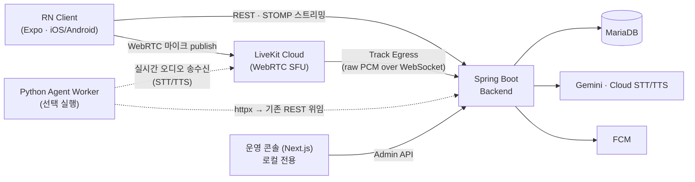

# Storia

AI 캐릭터와 텍스트 채팅 · 실시간 음성 통화를 나누는 크로스플랫폼 앱. React Native(Expo) 클라이언트 + Spring Boot 백엔드 + LiveKit(WebRTC) 음성 통화 + Next.js 운영 콘솔을 1인으로 설계·구현하고, iOS TestFlight / Google Play 내부 테스트까지 실제 배포했습니다.

[](https://github.com/UiHyungZo/storia-story-chat/actions/workflows/ci.yml)


## 데모 — 채팅 리스트 FlatList → FlashList


iPhone 12 Pro · Development build · RN Perf Monitor · 메시지 1,000개 빠른 플링 스크롤 (2026-10-03 촬영). 측정값과 해석은 [아래](#1-flashlist-전환--메모리는-줄고-js-fps-최저치는-나빠짐) 참고.

고화질 영상:

https://github.com/user-attachments/assets/19983757-12f3-4861-8a28-cd6be94f2b37

## 아키텍처



- **텍스트 채팅**: WebSocket(STOMP)으로 Gemini 응답을 청크 단위 스트리밍, 연결 실패 시 REST 폴백 + 지수 백오프 재연결
- **음성 통화("축소판 A안")**: 클라이언트↔LiveKit 구간은 실제 WebRTC, 서버는 Track Egress로 raw PCM만 받아 배치 STT → Gemini → TTS로 처리. 왜 이렇게 나눴는지는 [기술 블로그 초안](./docs/blog-webrtc-tradeoffs.md) 참고
- **완전한 실시간 음성(선택)**: `apps/python-sidecar`의 LiveKit Agents 워커. LLM 단계는 Spring REST에 위임해 캐릭터 프롬프트/영속화 로직이 두 런타임에 중복되지 않음
- 외부 자격증명(Gemini/LiveKit/STT/TTS/FCM/Sentry)은 전부 **미설정 시 조용히 비활성화** — 키 없이도 텍스트 채팅은 동작

시퀀스 다이어그램 포함 상세: [`docs/architecture`](./docs/architecture/README.md)

```
apps/
├── client/         # React Native (Expo, TypeScript)
│   └── modules/storia-native/  # 로컬 Expo 모듈 — iOS(Swift) / Android(Kotlin) 네이티브 코드
├── backend/        # Spring Boot 4.0.7 (Java 17)
├── admin/          # Next.js 15 운영 콘솔 (캐릭터 설정/대화 로그/음성 세션 관리, 로컬 전용)
└── python-sidecar/ # LiveKit Agents 워커 — 완전한 실시간 음성 (선택 실행)
docs/                # 아키텍처, ERD, API, ADR, 테스트/CI/배포 문서
```

## 기술적으로 다룬 문제

### 1. FlashList 전환 — 메모리는 줄고, JS FPS 최저치는 나빠짐

| | FlatList (Before) | FlashList (After) |
|---|---|---|
| 스크롤 중 RAM 증가 | 약 +105MB | **약 +32MB** |
| UI FPS | 60 | 57~60 |
| JS FPS 최저치 | 30 | 20 (9/13 측정에선 6~8) |

- 셀 재활용으로 스크롤 중 메모리 증가폭은 확실히 줄었고, 두 차례 측정 모두 같은 경향이었습니다.
- 반면 긴 플링에서 **JS FPS 최저치는 오히려 낮아졌습니다.** FlashList v2에는 `inverted`가 없어 채팅 리스트를 `maintainVisibleContentPosition={{ startRenderingFromBottom: true }}`로 바꿨는데, 큰 점프 시 위치 재계산 비용이 원인으로 추정됩니다(미검증).
- 10/3 촬영본은 두 영상의 플링 세기가 같지 않아 JS FPS 비교는 참고용입니다.
- 측정 방법: 로컬 DB에 더미 메시지 1,000개를 SQL로 직접 넣고(API/LLM 호출 없음), 실기기에서 Perf Monitor를 화면 녹화 → `ffmpeg`로 0.5초 간격 프레임을 뽑아 판독.

### 2. Native Module — iOS/Android 대칭 구현 + `expo prebuild`에서 살아남는 구조

- `ios/`·`android/`는 커밋하지 않고 `expo prebuild`로 매번 재생성하므로, 네이티브 코드를 그 안에 두면 다음 prebuild 때 사라집니다.
- 그래서 Expo가 기본 탐색하는 `apps/client/modules/storia-native`에 **로컬 Expo 모듈**로 두고 `expo-modules-autolinking`이 CocoaPod/Gradle 링크를 하게 했습니다.
- iOS(Swift, `RCTBridgeModule`)와 Android(Kotlin, `ReactContextBaseJavaModule`)가 같은 브릿지 이름 `NativeModules.HapticNotifier.notify()`를 노출해, JS는 플랫폼 분기 없이 햅틱 + 포그라운드 로컬 알림을 호출합니다.

### 3. WebRTC — `setMicrophoneEnabled(false)`는 unpublish가 아니었다

- 턴이 끝나면 마이크 트랙이 unpublish된다고 가정했지만, `livekit-client` 2.22는 오디오 트랙을 **mute만** 합니다(unpublish는 screen-share만).
- 트랙이 계속 published 상태라 Track Egress가 끝나지 않았고, 서버는 턴 종료를 감지하지 못해 클라이언트가 75초 폴링 타임아웃에 걸렸습니다.
- 헤드리스 검증은 `lk` 프로세스 kill(하드 disconnect)이라 이 차이가 드러나지 않았고, **실기기에서 정상 종료할 때만** 재현됐습니다. `startListening`에서 저장한 publication을 `unpublishTrack(track, true)`로 명시적으로 내리도록 수정했습니다.
- 반대로 egress가 서버까지 붙지 못한 턴이 메모리에 영원히 남는 문제도 있어, 5분 기준으로 오래된 턴을 정리하는 `VoiceTurnRegistry#sweepStaleSessions` 스케줄러를 추가했습니다.

그 밖의 트러블슈팅(스테레오/모노 불일치로 STT 0건, TTS 응답 256KB 버퍼 초과, 실기기 전용 dyld 크래시, Xcode 버전별 CI 빌드 실패 등)은 [HANDOFF](./HANDOFF.md)와 [CI/CD 디버깅 일지](./docs/cicd.md)에 있습니다.

## 테스트 / CI

| 영역 | 도구 | 규모 |
|---|---|---|
| 백엔드 | JUnit5 + Mockito, `@WebMvcTest`, `@DataJpaTest` (H2 인메모리) | 12개 파일 · 38개 케이스 |
| 클라이언트 | `jest-expo` + `@testing-library/react-native` | 단위 17 + UI 17 |

- **CI** (`.github/workflows/ci.yml`): push/PR마다 `./gradlew test`, `tsc --noEmit`, `jest --ci`를 별도 job으로 실행. 시크릿 불필요.
- **릴리스** (`.github/workflows/release.yml`, 태그 트리거): Fastlane으로 iOS는 `.p12` 수동 서명 + `gym`/`pilot` → TestFlight(`macos-26` 러너), Android는 `bundleRelease` + `supply` → Play 내부 테스트. EAS 대신 직접 구축한 이유는 [ADR-008](./docs/decisions.md).
- WebRTC 트랙 상태·마이크 권한·오디오 라우팅처럼 자동화로 검증할 수 없는 부분은 **실기기(iPhone) 수동 검증**을 별도 단계로 거쳤습니다. 위 3번 같은 버그가 여기서만 나왔습니다.

세부 규칙: [테스트 정책](./docs/testing.md) · [CI/CD](./docs/cicd.md)

### 배포 현황

목표는 스토어 정식 출시가 아니라 **"RN으로 iOS/Android 양쪽 실제 배포 파이프라인까지 처리할 수 있음"을 증명하는 것**입니다.

- [x] **iOS**: TestFlight에 실제 빌드 도착 확인 (2026-09-11)
- [x] **Android**: Play 내부 테스트 트랙 출시, 옵트인 링크로 실기기 설치 확인 (2026-09-12)
- [x] 스토어 관문 설문 3종 (Play Data Safety / Apple App Privacy / Export Compliance)

백엔드는 상시 운영하지 않고 데모 시점에만 로컬/LAN으로 기동합니다(근거: ADR-007). 런북: [`docs/deployment.md`](./docs/deployment.md)

## 로컬 실행

### 1. DB

```bash
docker compose up -d
```

### 2. 백엔드 (Spring Boot)

모든 외부 키는 선택입니다. 없으면 해당 기능만 비활성화됩니다.

```bash
export GEMINI_API_KEY=your-api-key            # 없으면 고정 안내 문구만 응답

# 음성 통화 (없으면 음성 통화 API는 503, 텍스트 채팅은 정상)
export LIVEKIT_HOST=your-project.livekit.cloud   # scheme(wss://) 없이
export LIVEKIT_API_KEY=your-livekit-api-key
export LIVEKIT_API_SECRET=your-livekit-api-secret
export LIVEKIT_EGRESS_AUDIO_WS_URL=wss://your-tunnel.example.com/egress/audio  # 로컬 개발 시 ngrok 등 터널 필요 (localhost 불가)
export STT_API_KEY=your-google-cloud-key
export TTS_API_KEY=your-google-cloud-key

export FIREBASE_CREDENTIALS_PATH=/path/to/service-account.json  # 없으면 FCM 발송 no-op
export ADMIN_PASSWORD=your-admin-password     # 없으면 운영 콘솔 로그인 전부 거부
export SENTRY_DSN=your-sentry-dsn             # 없으면 Sentry 비활성화
```

```bash
cd apps/backend
./gradlew bootRun
./gradlew test        # H2 인메모리 — MariaDB 없어도 실행됨
```

- REST API: `http://localhost:8080/api/characters`
- WebSocket(STOMP): `ws://localhost:8080/ws`
- Swagger UI: `http://localhost:8080/swagger-ui.html`
- Docker 이미지: `docker build -t storia-backend apps/backend` (multi-stage)

### 3. 클라이언트 (Expo)

Expo Go는 지원하지 않습니다 (커스텀 Native Module 사용 — Development Build 필수).

```bash
cd apps/client
npm install

SENTRY_DISABLE_AUTO_UPLOAD=true npx expo run:ios       # 최초 1회 (Xcode + CocoaPods 필요)
SENTRY_DISABLE_AUTO_UPLOAD=true npx expo run:android   # Android SDK 필요

npx expo start     # 이후 개발 시 (Metro만 재기동)
npm test
```

> `SENTRY_DISABLE_AUTO_UPLOAD=true`가 없으면 `@sentry/react-native` 빌드 스크립트가 소스맵 업로드를 시도하다 로컬 빌드가 깨집니다.

실기기 테스트 시에는 개발 머신의 LAN IP를 직접 지정하세요 (시뮬레이터=`localhost`, 에뮬레이터=`10.0.2.2`만 자동 분기). `EXPO_PUBLIC_*`를 바꾸면 Metro도 재기동해야 반영됩니다.

```bash
export EXPO_PUBLIC_API_BASE_URL=http://<개발-머신-LAN-IP>:8080
export EXPO_PUBLIC_SENTRY_DSN=your-sentry-dsn   # 선택
```

### 4. 운영 콘솔 (`apps/admin`, 선택)

캐릭터 `systemPrompt`/`concept`/`ttsVoiceId` 수정, 대화 로그 필터링·페이지네이션, 음성 세션 상태 조회용 Next.js 앱. 백엔드가 `ADMIN_PASSWORD`와 함께 떠 있어야 합니다.

```bash
cp apps/admin/.env.local.example apps/admin/.env.local   # ADMIN_BACKEND_URL=http://localhost:8080
cd apps/admin && npm install && npm run dev
```

`http://localhost:3000`에서 `ADMIN_PASSWORD`로 로그인합니다.

### 5. Python 사이드카 (`apps/python-sidecar`, 선택)

LiveKit Agents 기반 완전한 양방향 실시간 음성(TTS까지 WebRTC로 재생). 실행하지 않아도 기본 음성 통화는 동작합니다. Python 3.10~3.14 + 별도 GCP 서비스 계정 필요 — [`apps/python-sidecar/README.md`](./apps/python-sidecar/README.md) 참고.

## 구현 범위

- **텍스트 채팅**: REST + WebSocket(STOMP) 스트리밍, Gemini 연동, WS 재연결(지수 백오프), 로딩/오류/재시도 UI, AsyncStorage 로컬 캐시, MariaDB 히스토리 영속화
- **음성 통화**: 축소판 A안 + 선택적 확장(Python 사이드카)으로 완전한 실시간 음성까지, 실기기에서 발화 중 끼어들기(interruption)까지 검증
- **Native Module**: iOS(Swift) / Android(Kotlin) Haptic + 포그라운드 로컬 알림
- **푸시 알림**: FCM 백엔드 연동 + 클라이언트 토큰 등록, 재참여(re-engagement) 스케줄러
- **운영 콘솔**: Next.js 15, `ADMIN_PASSWORD` + httpOnly cookie 세션, 실제 MariaDB + 브라우저로 로그인~로그아웃 전체 플로우 검증
- **모니터링**: Sentry(클라이언트+백엔드), 전역 REST 예외 처리기

**의도적으로 범위 밖에 둔 것**: 정식 로그인(디바이스 ID 기반 익명 세션으로 대체), 다중 대화 세션, TURN 서버, 백엔드·운영 콘솔의 외부 상시 배포 — 근거는 [PRD 9절](./PRD/Storia_PRD_final.md)과 [ADR](./docs/decisions.md).

## 문서

- [아키텍처](./docs/architecture/README.md) — 구현 상태, WebSocket/WebRTC 시퀀스 다이어그램
- [ERD](./docs/erd/README.md) · [API](./docs/api.md) · [에러 처리 정책](./docs/error-handling.md)
- [의사결정 기록(ADR)](./docs/decisions.md) — DB 선택, 인증 방식, 음성 통화 B안/C안, 배포 방식 등 트레이드오프와 갱신 이력
- [기술 블로그 초안 — WebRTC 트레이드오프](./docs/blog-webrtc-tradeoffs.md)
- [테스트 정책](./docs/testing.md) · [CI/CD](./docs/cicd.md) · [배포 런북](./docs/deployment.md)
- [개인정보처리방침](./docs/legal/privacy-policy.md)
- [PRD](./PRD/Storia_PRD_final.md) · [HANDOFF](./HANDOFF.md) · [TODO](./TODO.md)
