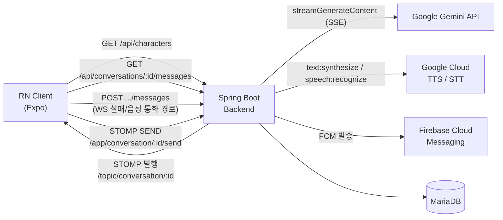
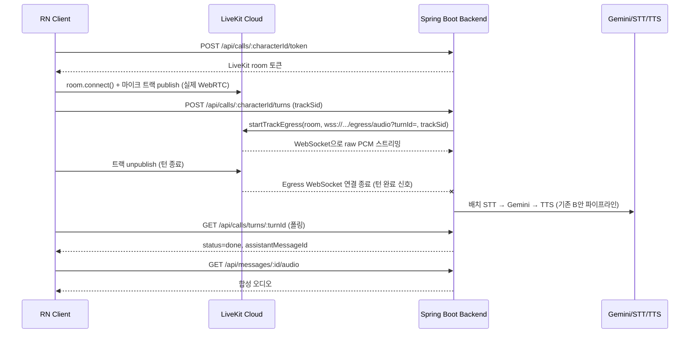

# 아키텍처

## 현재 구현 상태 (Week 7 — 실행 검증 진행 중, [`HANDOFF.md`](../../HANDOFF.md) 참고)

텍스트 채팅(REST + WebSocket/STOMP + Gemini 스트리밍), WS 재연결, 로컬 캐시, Native
Module(Haptic+로컬 알림), FCM 푸시 백엔드, 음성 통화(LiveKit 기반 "축소판 A안")까지
코드로는 연결되어 있습니다.

## 음성 통화 — "축소판 A안" (5주차, PRD 3.9 / ADR-004 갱신)

풀 실시간 양방향 WebRTC 파이프라인(A안)은 서버 쪽 WebRTC 미디어 처리(JVM에 마땅한
라이브러리 없음)가 일정 대비 리스크가 커서, 아래처럼 축소했습니다:

- 클라이언트 ↔ LiveKit(Cloud) 구간은 **진짜 WebRTC**로 마이크 오디오를 전송
- 백엔드는 WebRTC 미디어를 직접 다루지 않고, LiveKit **Track Egress → WebSocket**
  (raw PCM, `/egress/audio`)으로 오디오를 받아 기존 **배치** STT/Gemini/TTS(B안)
  파이프라인에 그대로 흘려보냄
- 응답은 B안과 동일하게 **오디오 URL**로 반환 — 서버가 합성 음성을 다시 WebRTC로
  실시간 되쏘는 것(완전한 A안)은 범위 밖으로 남겨둠

**로컬 개발 시 주의**: LiveKit Cloud(원격 서비스)가 `/egress/audio`로 다시 접속해와야
하므로, 이 백엔드가 `localhost`가 아니라 공인 접근 가능한 주소여야 함(ngrok 등 터널
필요) — [`HANDOFF.md`](../../HANDOFF.md) 참고.

## 6주차 — WebRTC 시그널링 최소 데모 (C안)

5주차에서 이미 LiveKit으로 클라이언트↔서버 실제 WebRTC 연결을 구현했기 때문에, PRD가
원래 C안에 기대했던 "WebRTC 연동 경험 증명" 자체는 상당 부분 충족된 상태입니다. 6주차는
이를 검증/보완하는 정도로 가벼워질 전망 — 자세한 판단은 [`TODO.md`](../../TODO.md) 참고.
