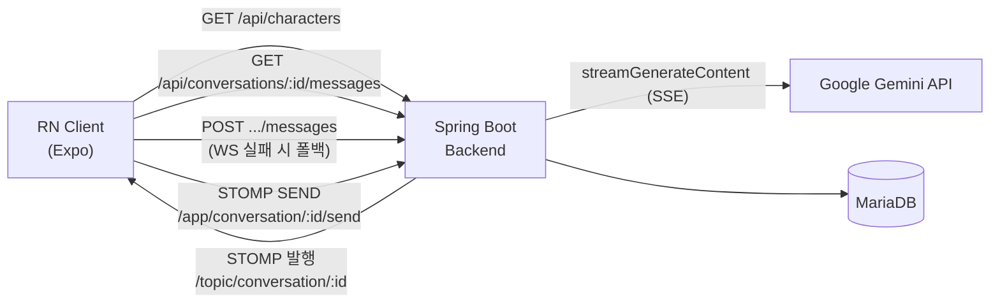
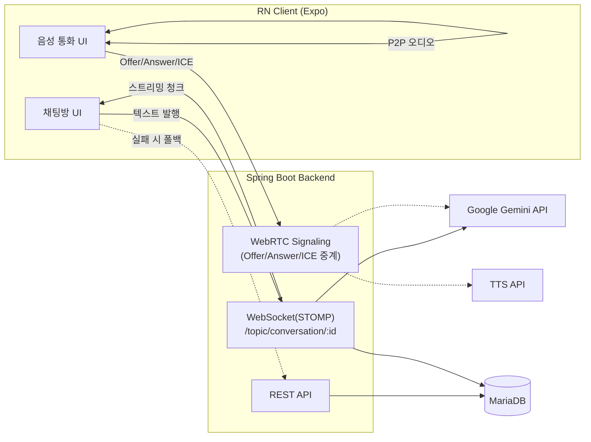

# 아키텍처

## 현재 구현 상태 (Week 2)

REST + WebSocket(STOMP) + Gemini 스트리밍까지 연결되어 있습니다 (실행 검증은 아직 안 됨, [`HANDOFF.md`](../../HANDOFF.md) 참고). WebRTC 음성 통화는 아직 구현되지 않았습니다 (PRD v3 마일스톤 5~6주차).

## 목표 아키텍처 (PRD v3 최종 형태)

텍스트는 WebSocket(STOMP)으로 Gemini 스트리밍을 중계하고, 음성 통화는 WebRTC로 Signaling을 처리한 뒤 STT → LLM → TTS 파이프라인을 거칩니다. 자세한 내용은 [`PRD/Storia_PRD_v3.md`](../../PRD/Storia_PRD_v3.md) 3.3, 3.9 참고.

