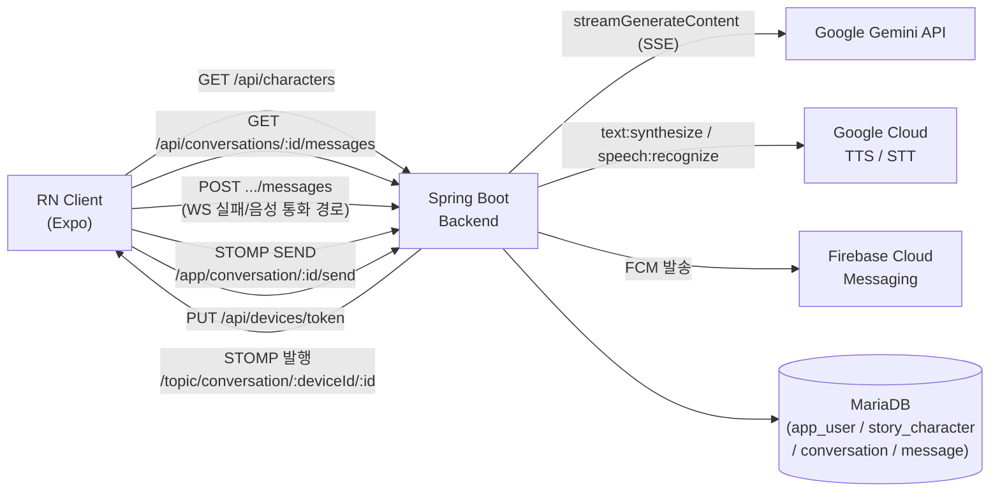
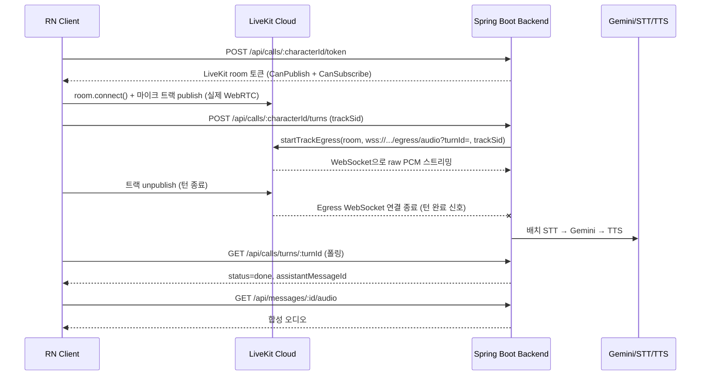
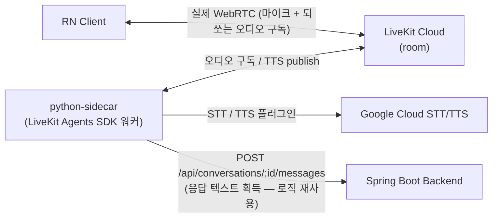

# 아키텍처

요구사항 전체는 [`PRD/Storia_PRD_final.md`](../../PRD/Storia_PRD_final.md), 주요 트레이드오프는
[`docs/decisions.md`](../decisions.md) 참고. **"코드가 어디까지 작성됐나"는 이 문서, "어디까지
실제로 실행 검증됐나"는 [`HANDOFF.md`](../../HANDOFF.md) / [`TODO.md`](../../TODO.md)를 본다.**

## 현재 구현 상태 (PRD final 1~7주차)

PRD 1~7주차 코드는 전부 연결되어 있습니다:

- **텍스트 채팅**: REST + WebSocket(STOMP) + Gemini(`gemini-3.6-flash`) 스트리밍, 지수 백오프
  WS 재연결, AsyncStorage 로컬 캐시, MariaDB 히스토리 영속화
- **Native Module**: iOS(Swift) / Android(Kotlin)가 동일한 `NativeModules.HapticNotifier.notify()`
  인터페이스로 Haptic + 포그라운드 로컬 알림
- **푸시**: FCM 백엔드(Admin SDK) + 클라이언트 토큰 등록 + 재참여 스케줄러
- **음성 통화**: LiveKit 기반 "축소판 A안"(아래)
- **운영**: Sentry(클라+백엔드), 자동화 테스트(백엔드 18 / 클라 17), GitHub Actions CI,
  백엔드 Dockerfile, 전역 REST 예외 처리기

## 음성 통화 — "축소판 A안" (PRD 3.9 / ADR-004 갱신 1~3)

완전한 양방향 실시간 WebRTC 파이프라인(원래 정의의 A안: 서버가 합성 음성을 WebRTC로
실시간 되쏘기)은 서버 쪽 WebRTC 미디어 처리에 JVM용 표준 라이브러리가 없어 일정 대비
리스크가 큽니다. 아래처럼 축소했습니다:

- 클라이언트 ↔ LiveKit(Cloud) 구간은 **진짜 WebRTC**로 마이크 오디오를 전송
  (ICE / DTLS-SRTP / 트랙 publish 포함 — SDK는 `@livekit/react-native`)
- 백엔드는 WebRTC 미디어를 직접 다루지 않고, LiveKit **Track Egress → WebSocket**
  (raw PCM `pcm_s16le`, `/egress/audio` — STOMP `/ws`와 별개인 raw WebSocket)으로 오디오를
  받아 **배치** STT/Gemini/TTS 파이프라인에 흘려보냄. Egress를 S3 등 저장소로 보내는 대신
  WebSocket 직접 스트리밍 옵션을 써서 별도 클라우드 스토리지 계정이 필요 없음
- 응답은 **오디오 URL**로 반환(`GET /api/messages/:id/audio`가 요청 시점에 합성, 사전 저장
  없음) — 서버가 합성 음성을 다시 WebRTC로 실시간 되쏘는 것은 범위 밖(아래 "선택적 확장" 참고)
- 턴 상태는 DB가 아닌 인메모리(`VoiceTurnRegistry`). 메시지 자체는 새 실시간 채널을 만들지
  않고 REST 전용 경로(`sendMessageViaRest`)를 재사용

**로컬 개발 시 주의**: LiveKit Cloud(원격)가 `/egress/audio`로 다시 접속해와야 하므로,
이 백엔드가 `localhost`가 아니라 공인 접근 가능한 주소여야 함(ngrok 등 터널 필요) —
[`HANDOFF.md`](../../HANDOFF.md) 참고.

**자격증명 미설정 시**: `LIVEKIT_*` 없으면 `/api/calls/**`가 `503`(음성 통화 자체가
성립 불가하므로 조용한 no-op이 아니라 명시적 에러). `STT_API_KEY`/`TTS_API_KEY` 없으면
STT는 `null`, `/api/messages/:id/audio`는 `404`로 저하되고 클라이언트는 텍스트만 남기고
다음 턴으로 넘어감.

## 선택적 확장 — 완전한 A안 (`apps/python-sidecar/`, 스켈레톤)

서버가 합성 TTS를 LiveKit room에 오디오 트랙으로 **실시간 publish**하는 완전한 양방향까지
가려면, LiveKit이 이 문제를 Python/Node **Agents SDK**로 푸는 것을 표준으로 삼기 때문에
Spring에 붙이지 않고 **별도 프로세스 + REST 통신** 사이드카 패턴을 택했습니다.

- **위 "축소판 A안" 경로의 대체가 아니라 추가 대안 경로**입니다. Agent 워커가 떠 있으면
  자동으로 새 room에 들어와 실시간으로 응답하고, 안 떠 있으면 축소판 경로만 동작합니다.
- Agent가 room에 봇으로 들어가 유저 오디오 구독 → STT/TTS는 플러그인 → 응답 텍스트는
  **기존 Spring REST**(`POST /api/conversations/{characterId}/messages`)를 그대로 호출해
  획득(로직 중복 없음).
- Spring 측 변경은 클라이언트 토큰 그랜트 `CanSubscribe(false) → true` 한 곳뿐.
- **현재 스켈레톤 상태**: `pip install`·설치된 패키지 API 정합성까지만 검증. 실제 room
  연결 / automatic dispatch / STT·TTS 왕복은 미검증(LiveKit·Google 자격증명 필요).
  상세는 [`apps/python-sidecar/README.md`](../../apps/python-sidecar/README.md).

## WebRTC 시그널링 최소 데모 (원래의 C안) — 별도 구현 없이 종료

PRD v3는 B안(WebRTC 없음) + 별도 C안(수동 시그널링 P2P 데모)을 계획했으나, "축소판 A안"이
클라이언트↔LiveKit 구간에 실제 WebRTC 미디어 연결(마이크 캡처·ICE·DTLS-SRTP·트랙 publish)을
이미 포함하므로 C안의 목적("WebRTC 연동 경험 증명")이 선행 충족됐다고 판단해 **추가 코드
없이 종료**했습니다(ADR-004 갱신 3).

- 남는 차이: LiveKit SDK가 Offer/Answer/ICE 교환을 내부 처리하므로 "수동 시그널링 프로토콜을
  직접 구현한 코드"는 없음.
- `react-native-webrtc` 기반 수동 P2P 데모로 되돌릴 여지는 남겨둠([`TODO.md`](../../TODO.md) 6주차).
