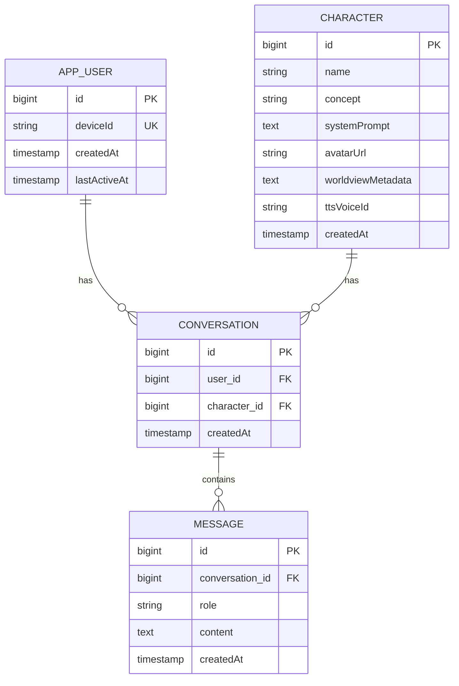

# ERD

Week 1 기준 구현된 스키마 (`apps/backend/.../entity`). User 테이블은 PostgreSQL 예약어 충돌을 피하기 위해 `app_user`로 매핑했습니다.

**제약조건**
- `CONVERSATION(user_id, character_id)` UNIQUE — 캐릭터당 하나의 연속 대화만 허용
- `MESSAGE(conversation_id)` 인덱스 — 히스토리 조회 최적화
- `APP_USER(deviceId)` UNIQUE — 디바이스 ID 기반 익명 세션 식별
